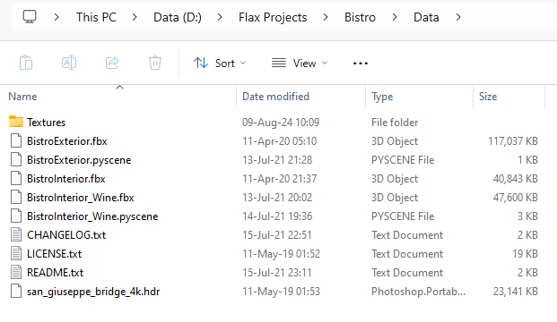

# Amazon Lumberyard Bistro for Flax Engine

This repository contains a [Flax Engine](https://flaxengine.com/) project set up for the [Amazon Lumberyard Bistro](https://developer.nvidia.com/orca/amazon-lumberyard-bistro) scene.

It utilizes Dynamic Global Illumination (**DDGI**) for realtime-lighting.

Minimum Flax version: `1.9`

How to open the project

## Installation

1. Clone this repository

2. Open `Bistro.flaxproj` with Flax

## How to reimport source assets

1. Download [Amazon Lumberyard Bistro](https://developer.nvidia.com/orca/amazon-lumberyard-bistro)

2. Extract `Bistro_v5_2.zip` contents directly into `Data` folder

3. Now, you can reimport models and textures from source files
